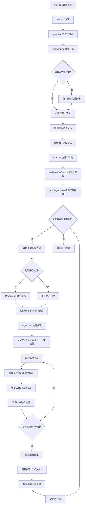
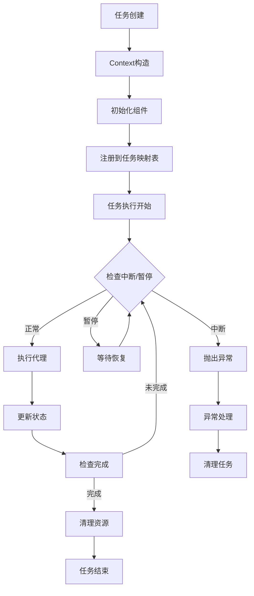
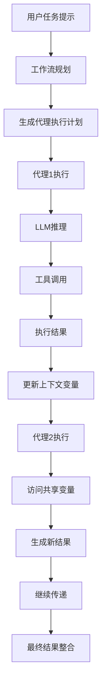
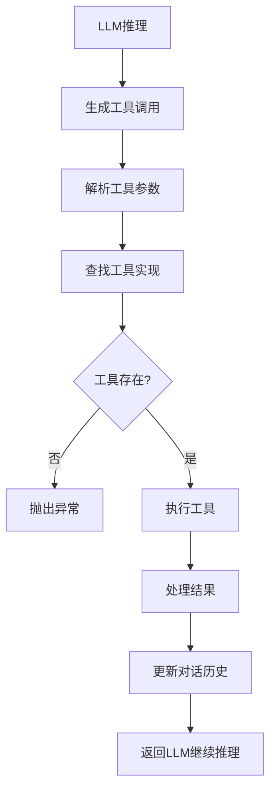
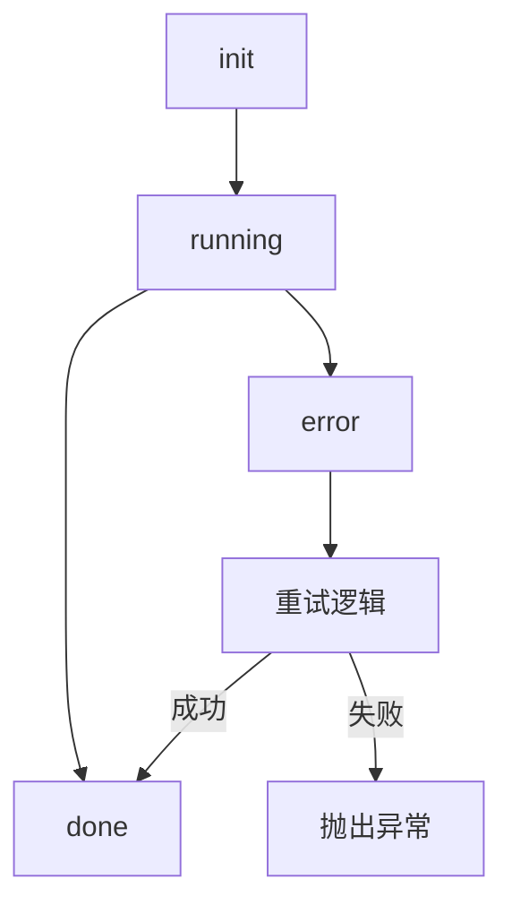

# Eko 多Agent系统架构详解

## 系统概述

Eko是一个基于大语言模型的智能代理编排框架，支持复杂任务的自动化执行。该系统采用多Agent架构，通过工作流规划和智能代理协作来完成各种复杂的任务。

## 核心架构组件

### 1. Eko 主引擎类 (`Eko`)

Eko系统的主控制器，负责整个任务执行生命周期的管理。

**主要职责：**

- 任务生成（generate）：根据用户输入生成执行工作流
- 任务执行（execute）：执行生成的工作流
- 任务修改（modify）：修改已存在任务的工作流
- 任务管理：暂停、恢复、中止任务等

### 2. 上下文管理器 (`Context`)

任务级别的上下文管理器，维护单个任务的完整执行环境。

**主要职责：**

- 任务标识和配置管理
- 执行链和代理管理
- 变量存储和状态维护
- 暂停/恢复控制
- 中断控制和异常处理

### 3. 代理上下文 (`AgentContext`)

代理级别的上下文管理器，维护单个代理的执行状态。

**主要职责：**

- 代理实例管理
- 上下文关联
- 执行链管理
- 代理级变量作用域
- 错误计数跟踪
- 消息历史存储

### 4. 智能代理基类 (`Agent`)

所有智能代理的基类，定义了智能代理的标准接口和核心行为。

**主要职责：**

- 任务执行：接收并执行具体的任务请求
- 工具管理：组织和管理代理可用的工具集合
- LLM集成：与语言模型进行交互和推理
- 上下文管理：维护执行状态和对话历史
- 结果生成：整合多源信息生成最终结果

## 系统启动流程图



## Context管理机制详解

### 层次化上下文结构

```text
任务上下文 (Context)
├── 任务标识 (taskId)
├── 系统配置 (config)
├── 执行链 (chain)
├── 代理列表 (agents)
├── 中断控制器 (controller)
├── 变量存储器 (variables)
├── 暂停状态 (pauseStatus)
├── 当前步骤控制器集合 (currentStepControllers)
└── 对话历史 (conversation)

代理上下文 (AgentContext)
├── 代理实例 (agent)
├── 任务上下文 (context)
├── 代理执行链 (agentChain)
├── 代理级变量 (variables)
├── 连续错误计数 (consecutiveErrorNum)
├── 消息历史 (messages)
└── 对话历史 (conversation)
```

### Context生命周期



### 变量作用域管理

1. **任务级变量**：在整个任务执行期间共享
2. **代理级变量**：仅在当前代理执行期间有效
3. **系统变量**：由框架自动管理的特殊变量

## Agent间参数传递机制

### 参数传递路径



### 参数传递形式

#### 1. 变量存储器 (Variables Map)

```typescript
// 任务级变量
context.variables.set("result1", "代理1的执行结果");
context.variables.set("shared_data", { key: "value" });

// 代理级变量
agentContext.variables.set("local_var", "仅在当前代理有效");

// 访问变量
const sharedResult = agentContext.context.variables.get("result1");
```

#### 2. 执行链传递 (Chain)

```typescript
// 代理执行链记录执行历史
const agentChain = new AgentChain(agentNode.agent);
context.chain.push(agentChain);

// 工具调用链记录工具执行
const toolChain = new ToolChain(toolCall, request);
agentContext.agentChain.push(toolChain);
```

#### 3. 回调机制传递

```typescript
// 代理执行结果回调
config.callback.onMessage({
  taskId: context.taskId,
  agentName: agentNode.agent.name,
  nodeId: agentNode.agent.id,
  type: "agent_result",
  result: agentNode.result
}, agentContext);
```

### 典型参数传递场景

#### 场景1：文件处理链

```typescript
// Agent1: 文件读取Agent
const fileContent = await readFile("input.txt");
agentContext.context.variables.set("file_content", fileContent);

// Agent2: 内容分析Agent
const content = agentContext.context.variables.get("file_content");
// 进行内容分析...
agentContext.context.variables.set("analysis_result", analysis);
```

#### 场景2：浏览器自动化

```typescript
// BrowserAgent: 页面导航
await navigateTo("https://example.com");
agentContext.variables.set("current_url", "https://example.com");

// AnalysisAgent: 内容提取
const url = agentContext.context.variables.get("current_url");
// 提取页面内容...
```

## 工具系统架构

### 工具包装器 (ToolWrapper)

```typescript
class ToolWrapper {
  private tool: LanguageModelV2FunctionTool;
  private execute: ToolExecuter;

  async callTool(
    args: Record<string, unknown>,
    agentContext: AgentContext,
    toolCall: LanguageModelV2ToolCallPart
  ): Promise<ToolResult> {
    return this.execute.execute(args, agentContext, toolCall);
  }
}
```

### 工具调用流程



### 系统自动工具

1. **VariableStorageTool**：变量存储和管理
2. **ForeachTaskTool**：循环任务执行
3. **WatchTriggerTool**：监听触发器
4. **TaskResultCheckTool**：任务结果验证
5. **TodoListManagerTool**：待办事项管理

## 执行状态管理

### 代理状态流转



### 任务状态管理

```typescript
enum TaskStatus {
  INIT = "init",           // 初始状态
  RUNNING = "running",     // 执行中
  PAUSED = "paused",       // 暂停
  COMPLETED = "completed", // 完成
  ERROR = "error",         // 错误
  ABORTED = "aborted"      // 中止
}
```

## 错误处理和重试机制

### 错误处理层次

1. **工具级别错误**：单个工具调用失败
2. **代理级别错误**：代理执行过程中的异常
3. **任务级别错误**：整个任务执行失败

### 重试策略

```typescript
// 连续错误计数
agentContext.consecutiveErrorNum++;

// 达到阈值时抛出异常
if (agentContext.consecutiveErrorNum >= 10) {
  throw error;
}
```

## 并发和并行执行

### 并行执行配置

```typescript
// 全局并行配置
const agentParallel = config.agentParallel;

// 任务级覆盖
const agentParallel = context.variables.get("agentParallel");
```

### 并行执行流程

```typescript
if (agentParallel) {
  // 并行执行
  const results = await Promise.all(
    agents.map(agent => doRunAgent(agent))
  );
} else {
  // 串行执行
  for (const agent of agents) {
    await doRunAgent(agent);
  }
}
```

## 监控和回调机制

### 回调事件类型

```typescript
type CallbackMessage = {
  taskId: string;
  agentName?: string;
  nodeId?: string;
  type: "agent_start" | "agent_result" | "tool_result";
  // ... 其他字段
};
```

### 实时状态监控

```typescript
// 代理开始执行
config.callback.onMessage({
  type: "agent_start",
  taskId: context.taskId,
  agentName: agentNode.agent.name,
  nodeId: agentNode.agent.id
});

// 代理执行结果
config.callback.onMessage({
  type: "agent_result",
  taskId: context.taskId,
  agentName: agentNode.agent.name,
  result: agentNode.result
});
```

## 总结

Eko系统通过精心设计的多Agent架构实现了复杂任务的自动化执行：

1. **层次化架构**：从任务到代理再到工具的清晰层次
2. **状态管理**：完善的上下文管理和状态跟踪机制
3. **参数传递**：灵活的变量共享和链式传递机制
4. **错误处理**：多层次的错误处理和重试机制
5. **并发控制**：支持串行和并行执行模式
6. **监控机制**：实时状态监控和回调通知

这种设计使得系统既保持了良好的扩展性，又提供了强大的执行能力和可靠性。
